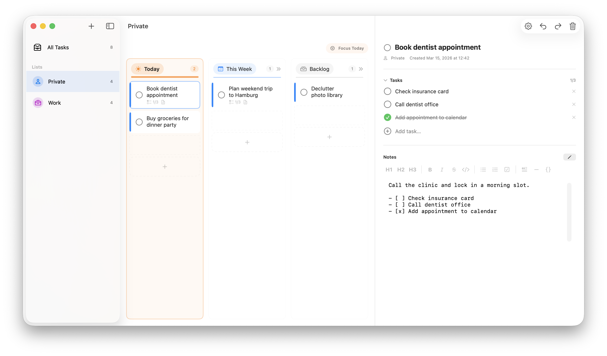
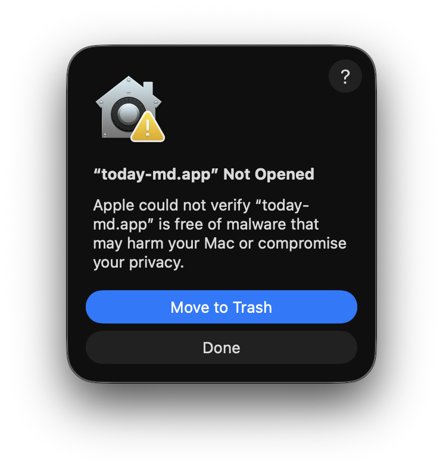
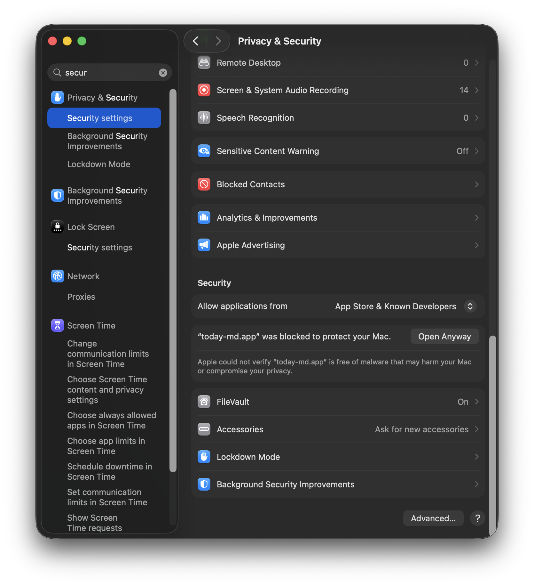

# today-md

Native macOS task manager for planning work across `Today`, `This Week`, and `Backlog`.

Built with SwiftUI, `@Observable` models, and a local SQLite store, `today-md` keeps tasks, subtasks, and Markdown notes in a lightweight local-first desktop app.



## Features

- Multiple task lists with custom names, icons, and colors
- Kanban-style planning lanes for `Today`, `This Week`, and `Backlog`
- Task detail view with subtasks and Markdown notes
- Drag-and-drop task movement and reordering
- Global search across task titles, notes, and subtasks from the centered toolbar search field
- Import and export of task data as JSON backups, with markdown note exports alongside them
- Automatic mirror of task notes as `.md` files in Application Support
- Seeded sample data on first install

## Tech Stack

- Swift 6
- SwiftUI
- Observation (`@Observable`)
- SQLite with FTS-backed search
- AppKit integrations for file import/export panels

## Requirements

- macOS 14.0+
- Swift 6.2+

## Getting Started

Build from the command line:

```bash
swift build
swift run today-md
```

For a real macOS app launch with the proper app icon, build and open the `.app` bundle instead:

```bash
bash scripts/dev-run.sh
```

Or open `today-md.xcodeproj` in Xcode and run the `today-md` target.

The app stores its local data in SQLite. In development builds that is `~/Library/Application Support/today-md/today-md.sqlite`; the sandboxed app bundle stores the same data inside its macOS container. Sample data is seeded only on the first app launch.

## Project Structure

- `Package.swift`: Swift Package manifest for `swift build` / `swift run`
- `today-md/TodayMdApp.swift`: app entry point and SQLite-backed observable store
- `today-md/ContentView.swift`: split-view shell, search, settings, import, and export flows
- `today-md/Models`: observable models plus codable archive types
- `today-md/Helpers/TodayMdDatabase.swift`: SQLite schema, load/save, and full-text search
- `today-md/Helpers/TodayMdTransferService.swift`: JSON backup import/export and markdown archive mirroring
- `today-md/Views`: board, sidebar, and task detail UI

## Installation

Download the latest `.zip` from the [Releases](https://github.com/arthurliebhardt/today-md/releases) page.

**Quick install** (downloads the latest release automatically):

```bash
curl -sL https://raw.githubusercontent.com/arthurliebhardt/today-md/main/scripts/install.sh | bash
```

The installer preserves an existing sandbox database and migrates older unsandboxed data into the app container when needed.

**Manual install:**

1. Unzip `today-md-v1.5.4-macos.zip`
2. Move `today-md.app` to your Applications folder
3. On first launch macOS will block the app because it's not notarized:

   

4. Open **System Settings → Privacy & Security** and click **Open Anyway**:

   

Alternatively, remove the quarantine flag via Terminal before opening:

```bash
xattr -d com.apple.quarantine /Applications/today-md.app
```

If you already downloaded a release zip and want to install that specific file instead, pass it to the script directly:

```bash
bash scripts/install.sh ~/Downloads/today-md-v1.5.4-macos.zip
```

## Data Portability

Each export creates a dated `today-md-eport-{date}` folder containing the JSON backup and a markdown notes folder. Imported data can either be merged into the existing SQLite store or replace it completely.

Task notes are also mirrored automatically as Markdown files in `~/Library/Application Support/today-md/Markdown Archive/` so they can be reused outside the app.

Search is powered by a local SQLite full-text index over task titles, markdown notes, and subtask text.

## Contributing

Contributions are welcome. See [`CONTRIBUTING.md`](CONTRIBUTING.md) for setup, workflow, and pull request guidelines.

## License

Released under the MIT License. See [`LICENSE`](LICENSE).
